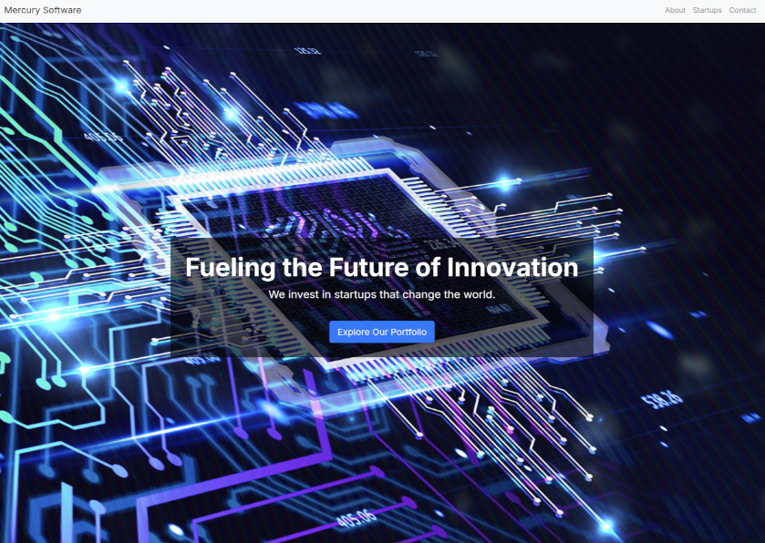
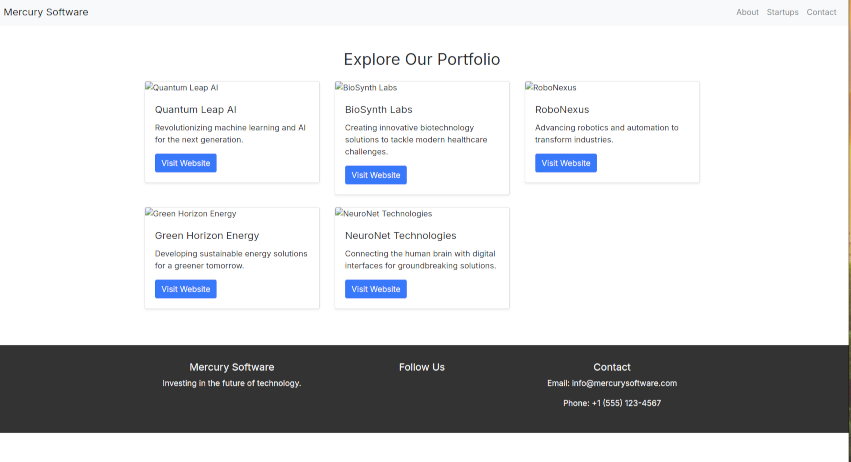
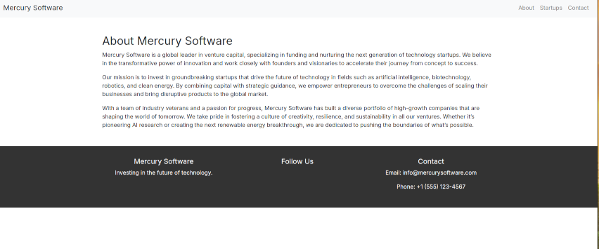
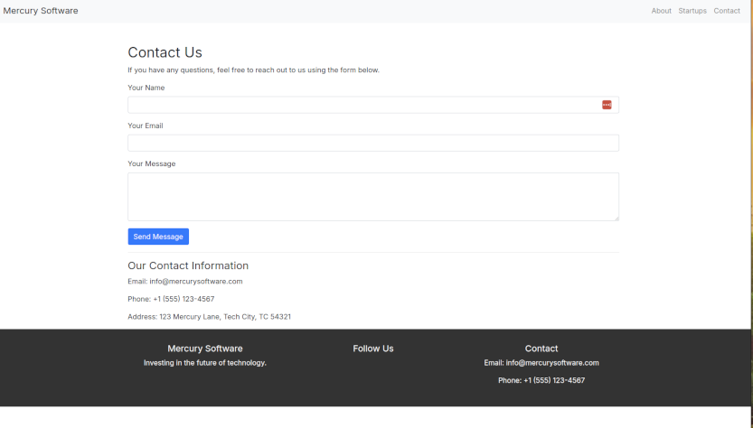

# Mercury Software Web Sitesi

Mercury Software, yapay zeka, biyoteknoloji, robotik ve temiz enerji gibi alanlarda yenilikçi startup'lara yatırım yaparak büyümeyi hedefleyen bir girişim sermayesi şirketidir. Bu web sitesi, Mercury Software'in portföyünü, şirket bilgilerini ve fon arayışındaki startup'lar için iletişim seçeneklerini sunmaktadır.

---

## Ana Sayfa



---

## Portföy Sayfası



---

## Hakkımızda Sayfası



---

## İletişim Sayfası



---

## Özellikler

- **Ana Sayfa**: Tam ekran arka plan görseli ve harekete geçirme butonu ile birlikte.
- **Portföy**: Hem ana sayfada hem de `/startups/` sayfasında bulunan kurgusal startup'ları keşfetme bölümü.
- **Hakkımızda**: Mercury Software'in misyonu, hedefleri ve yatırım stratejisi hakkında bilgi.
- **İletişim**: Startup'ların fon almak için başvurabileceği bir iletişim formu.

---

## Kullanılan Teknolojiler

- **Backend**: Django 4.2.11 (Python Web Framework)
- **Frontend**: Bootstrap 4.5 (CSS Framework)
- **Veritabanı**: SQLite (Django'nun varsayılan veritabanı)
- **Şablon Motoru**: Django Template Language
- **Statik Dosyalar**: Bootstrap, özel CSS ve görseller Django'nun statik dosya sistemi üzerinden sunulmaktadır.

---

## Kurulum Talimatları

1. **Projeyi klonlayın**:

    ```bash
    git clone https://github.com/kullaniciadi/mercury_software.git
    cd mercury_software
    ```

2. **Sanal ortamı oluşturun**:

    ```bash
    python3 -m venv venv
    source venv/bin/activate  # Linux/macOS için
    # Windows için: venv\Scripts\activate
    ```

3. **Gerekli bağımlılıkları yükleyin**:

    ```bash
    pip install -r requirements.txt
    ```

4. **Veritabanı migrasyonlarını uygulayın**:

    ```bash
    python3 manage.py migrate
    ```

5. **Geliştirme sunucusunu başlatın**:

    ```bash
    python3 manage.py runserver
    ```

6. Tarayıcınızı açın ve `http://127.0.0.1:8000/` adresine gidin.